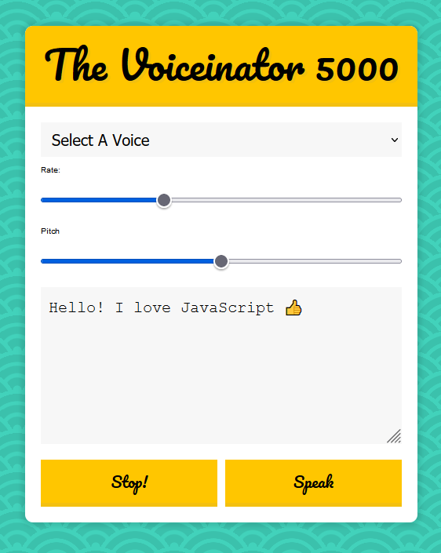

# JS-Text-To-Speech-App

JavaScript Text to Speech App

<!-- Live link to deployed app -->

Repository: https://github.com/Mdudzik92/JS-Text-To-Speech 
Deployed app: https://mdudzik92.github.io/JS-Text-To-Speech/

<!-- Technologies used -->

HTML, CSS, JavaScript, Speech Utterance Web API

<!-- Explanation of what the app is -->

This is an app in which the user can type their preferred message into the message input box, then have their message read back to them by whichever voice they choose from the dropdown menu. The user can also change the pitch of the voice, making it higher or lower in range, and the speed at which the message is read to them. If the user wants the message to end before it is fully read to them, they can click the stop button at any time. Give it a try!

<!-- Screenshot -->

<!-- License -->

MIT

<!-- Contact information -->

Email: mdudzik92@gmail.com
